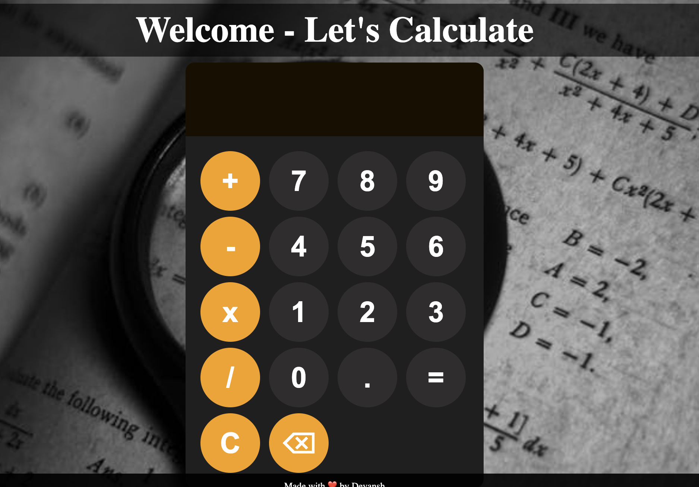

# Calculator

This is a basic calculator web application built using HTML, CSS, and JavaScript. It performs simple arithmetic operations like addition, subtraction, multiplication, and division.

---

## Calculator Interface

## Features

*   Addition, subtraction, multiplication, and division operations.
*   Clear display and backspace functionality.
*   Circular button design.
*   Responsive design (basic).

## Technologies Used

*   HTML: For structuring the calculator's layout.
*   CSS: For styling the calculator's appearance, including the circular buttons and background.
*   JavaScript: For implementing the calculator's logic and handling user interactions.

## How to Use

1.  Use the buttons to input numbers and operators.
2.  Click the "=" button to calculate the result.
3.  Use the "C" button to clear the display.
4.  Use the "⌫" button to backspace.

## Deployed Link

[Netlify Deployed Link](https://simple-calculator-41.netlify.app/)

